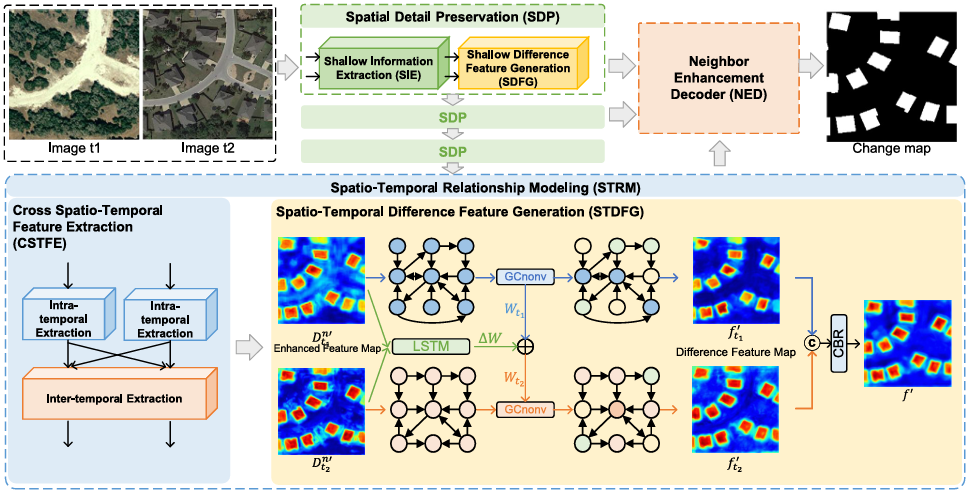
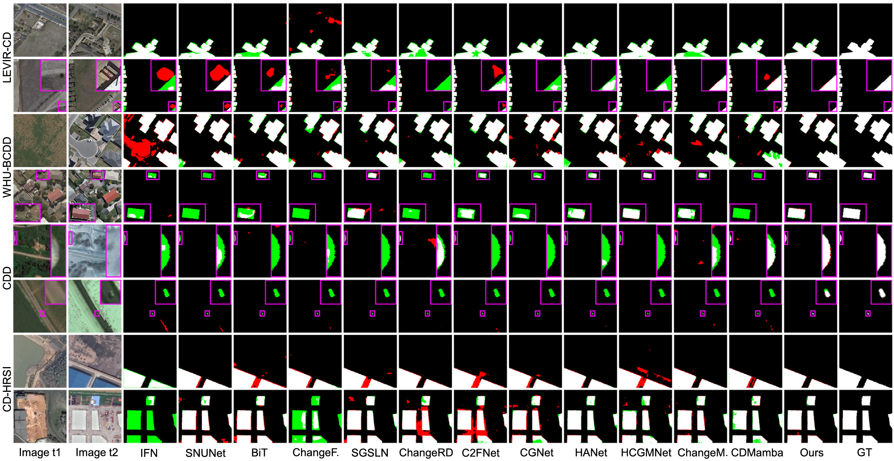

# STNet: A Spatio-Temporal Network for Binary Change Detection in High-Resolution Remote Sensing Images (ISPRS P&RS 2026) [](https://doi.org/10.1016/j.isprsjprs.2026.02.003)  [](https://doi.org/10.1016/j.isprsjprs.2026.02.003)

## Contributions
- A spatio-temporal network, termed as STNet, is designed to comprehensively establish long-dependency and spatio-temporal relationships. It can effectively produce entire, accurate and small-scale change regions with detailed boundaries.

- To address the problem of change region discontiguity, we propose a Spatio-Temporal Relationship Modeling module to extract both intra- and inter-temporal long range dependencies. On this basis, an LSTM-adaptive GCN that dynamically weights spatio-temporal relationships to precisely model regular and irregular change regions.

- To overcome the challenge of small-scale change regions imprecision, we design the Spatial Detail Preservation module that operates specifically in shallow network layers. Through its two-stage architecture, it effectively captures and retains fine-grained spatial information crucial for detecting subtle changes.

- To address the challenge of change boundaries inaccuracy, we develop the Neighbor Enhancement Decoder that strategically integrates the detail-rich features from SDP with semantically discriminative features from STRM. It achieves precise boundary localization while maintaining categorical accuracy in the final change detection results.

<figure>
  
  <figcaption>Overall framework of STNet for change detection of remote sensing images.</figcaption>
</figure>

## Results
<figure>
  
  <figcaption>Qualitative comparisons on four datasets (green: missed detection, i.e., false negatives; red: false detection, i.e., false positives).</figcaption>
</figure>

## Citation
If you find this work useful for your research, please cite our paper:
```bibtex
@article{lu2026stnet,
  title={STNet: A spatio-temporal network for binary change detection in high-resolution remote sensing images},
  author={Lu, Chen and Xu, Han and Zhang, Xian and Liu, Guangcan},
  journal={ISPRS Journal of Photogrammetry and Remote Sensing},
  volume={234},
  pages={60--71},
  year={2026},
  publisher={Elsevier},
  doi={https://doi.org/10.1016/j.isprsjprs.2026.02.003}
}
```
